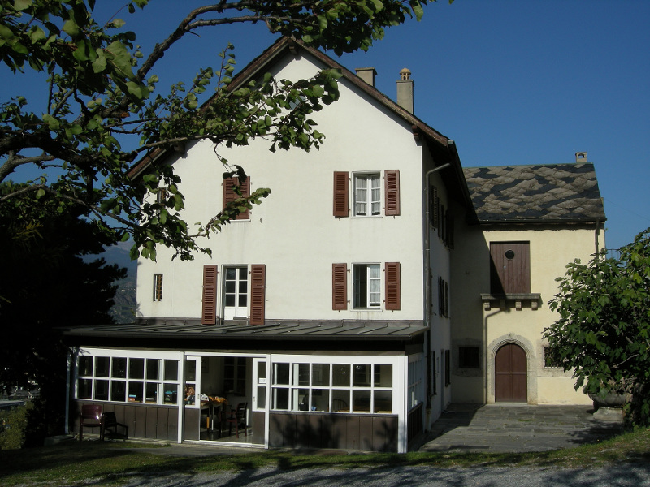
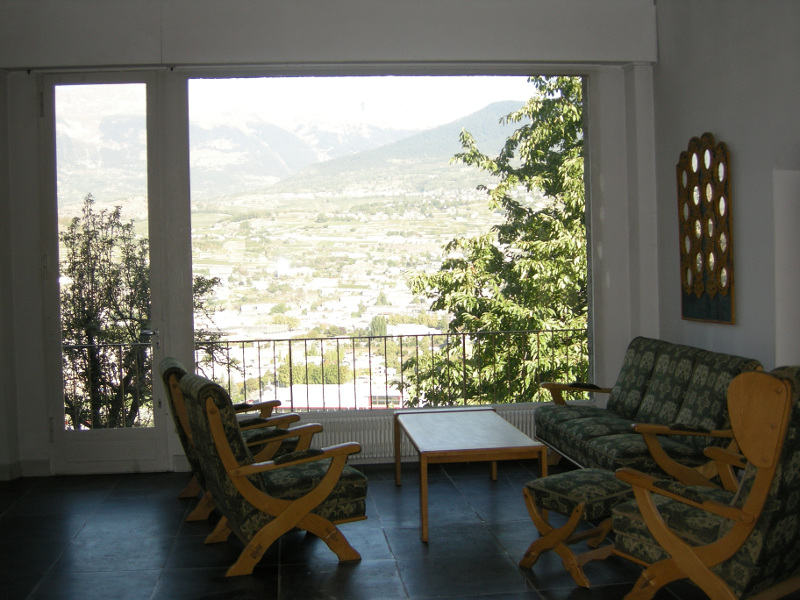
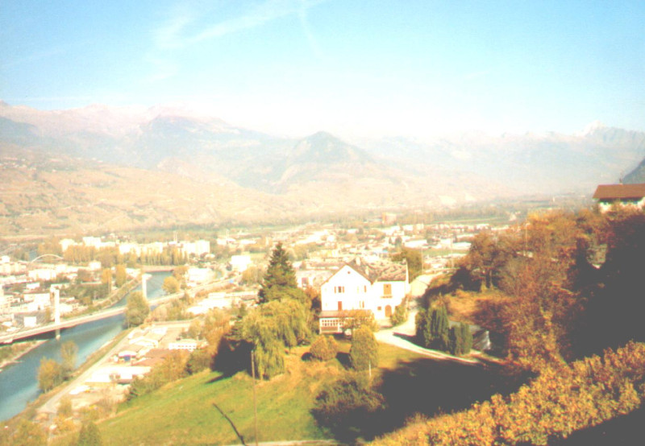

Analysis and Numerical Approximation of Constrained Systems
-----

> :rocket: Confirm your participation now!

A young academics workshop of the GAMM FA *Numerische Analysis* on theoretical and numerical aspects of DAEs. Organized by [Jan Heiland](http://www.mpi-magdeburg.mpg.de/person/29457/822630) and [Robert Altmann](http://www.math.uni-augsburg.de).

### Program

| Date | Item |
| ------- | ------ |
| April 15-17 | Arrival |
| April 16 | Casual meetings and open discussions |
| April 17-19 | Talks and thematic sessions |
| April 18-20 | Casual meetings and open discussions |
| April 19-22 | Departures |

### The Venue

The mansion *la maison blanche* in [Sion, Switzerland](http://www.openstreetmap.org/way/237002942), that has sleeping room for 10 and a seminar hall for 20.

#### Travel

Self-organized or by transfer 

| Route | Date | Info |
| ------- | --- | --- |
| Augsburg - Sion | Sunday, April 15, 9 AM | by car, 4/7 spots still available |
| Sion - Augsburg | to be announced | by car  |

#### Registration and fees

| Issue | Info |
| ------- | ------ |
| Registration | No fees here |
| Accommodation | 45 Euros -- flat charge |
| Catering | Jointly organized and self-paid |

### Participants

#### Confirmed

 - Robert Altmann (U Augsburg)
 - Marine Froidevaux (TU Berlin)
 - Jan Heiland (MPI Magdeburg)
 - Benny Unger (TU Berlin)

#### Invited

 - Manuela Paschkowski (Halle)
 - Ulrich R&ouml;mer (Braunschweig)
 - Jonas Witschel (Ilmenau)
 - Sara Grundel (MPI)
 - Frederic Haller (Hamburg)
 - Thomas Berger (Hamburg)
